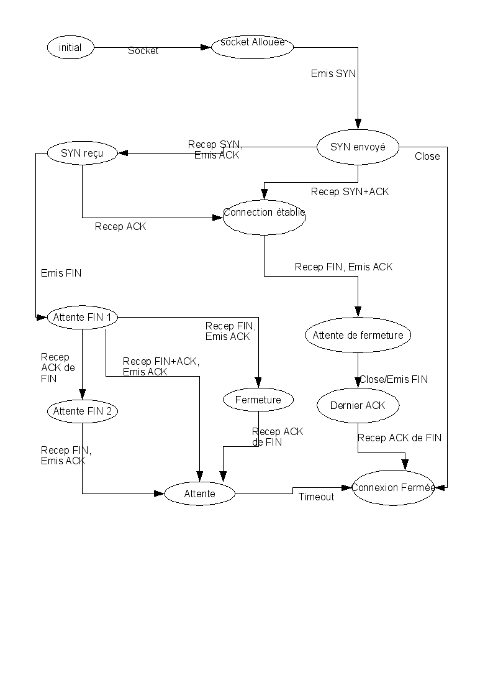
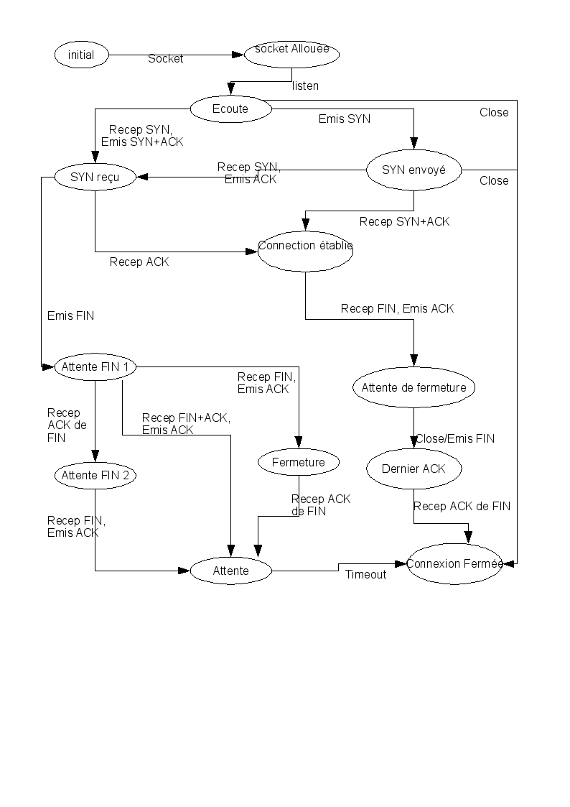

===========
TP 2 Réseau
===========

Le protocole ``ARP``
=====================

Syntaxe des paquets ``ARP``
----------------------------

Tout d'abord, nous avons vidé le cache ``ARP`` via la commande : ::

  arp -d -a

Nous avons ensuite lancé un ping vers la station 192.168.0.1 et capturé le résultat
à l'aide de tcpdump et analysé visuellement le résultat dans `Wireshark` (ethereal),
dont la capture d'ecran et donnée en annexe `Structure d'une requête ARP`_.

Identification de la trame :
::::::::::::::::::::::::::::

Comme on peut le constater sur la capture d'écran, le champ `Type` de la 
trame ethernet (surligné en bleu) contient la valeur 0x0806 et permet d'identifier 
le paquet comme étant une requête ``ARP``.

Place de la requête ARP dans le paquet :
::::::::::::::::::::::::::::::::::::::::

La requête ``ARP`` se situe dans le champ `data` du paquet.

Format de la trame ``ARP``
::::::::::::::::::::::::::

Toujours d'après notre capture d'écran de `Wireshark`, nous pouvons determiner la structure
du paquet ``ARP`` de cette manière : ::

        0        16        32      40      48         64         112        144       192       224
        | HT (16) | PT (16) | HS(8) | PS(8) | OpC (16) | SMA (48) | SIA (32) | TMA(48) | TIA(32) |

Les champs étant :

+ HT : hardware type,
+ PT: Protocole type,
+ HS : Hardware Size,
+ PS : Protocole Size,
+ OpC : Opcode.
+ SMA : Sender Mac Address,
+ SIA : Sender IP Address,
+ TMA : Target MAC Address,
+ TIA : Target IP Address,

Les différents champs sont visible dans la capture d'écran donnée en annexe `Structure d'une requête ARP`_.

Taille :
::::::::

Les trames ont un marqueur de début et de fin, ce qui permet de les isoler à la réception.
La couche ``Ethernet`` ignore la taille des paquets qu'elle transporte ; la gestion est déléguée au support des 
couches supérieures (taille fixe dans le cas d'ARP).
A l'émission, le support des couches supérieures s'occupe de la découpe de ses paquets selon les besoins (notament IPv4/6).

Transmission entre le paquet ``ARP`` et la couche ``Ethernet``
===============================================================

Toute la zone data : paquet + trailer (série de zéros permettant de compléter la trame) est transmise.
En considérant qu'un "bourrage" est un paquet ne tenant pas dans la zone `data` d'une trame, la couche ``Ethernet`` n'ayant aucune connaissance de la nature des données transportées en dehors de leur type qui indique à quel support de couche supérieure transmettre les données à la réception, elle ne se soucie pas des problématiques de bourrage qui sont déléguées à ce support.
Dans le cas d'ARP il n'y a pas e gestion du bourrage et les trames ``Ethernet`` doivent être d'une longueur suffisante pour en assurer le transport (trames de 42 o en excluant le préambule).

Algorithme du protocole ``ARP``
===============================

Après avoir effectuer les manipulations dictées par l'énoncé, nous avons complété l'algorithme de la 
manière suivante : ::

  tantque vrai faire
    attendre(événement)
       si événement est (requête interne de IP vers ARP) :
          si présent dans table ARP :
          sinon :
             envois requete ARP
          finsi.
       finsi.
       si événement est expiration du timer associé à une entrée
          Suppression de l'entrée dans la table ARP
       finsi.

       si événement est réception requête (ARP Request)
          si adresse MAC cible == adresse MAC locale :
             envois reponse ARP avec MAC locale.
             MAJ table ARP avec les infos de la source.
          finsi.
       finsi.
       si événement est réception réponse (ARP Reply) :
          si requete addressee à machine locale :
             Mise à jour de la table ARP.
          finsi.
       finsi
      ... (attention il y a d’autres évenements)
  fin tantque

Le protocole ICMP :
====================

Le protocole UDP :
==================

Format de l'en-tête UDP
------------------------

Description
::::::::::::

+ Source Port : port de la machine emmetrice,
+ Destination Port : port de la machine distante,
+ message lenght : taille totale du paquet (data + en-tête),
+ checksum : Somme de contrôle, défini dans la RFC 768, permet de vérifier l'intégrité du paquet.

A l'aide de socklab, nous avons transmis la chaîne "Hello world!" entre les deux hôtes.

Coté réception : ::

        recvfrom 3 100

Coté emission : ::

        sendto 1 192.168.0.15 4567
        >Hello World !

Le datagramme UDP reçu a une taille de 21o, correspondant aux 13o du champ data (48 65 6c 6c 6f 20 77 6f 72 6c 64 20 21, correspondant à la chaîne de caractères "Hello world !") plus la taille de l'en-tête.

Expériences :
:::::::::::::

+ Si on lance la réception avant l'emmission : l'hôte écoutant reçois les données lorsque l'hôte emmettant envois les données.
+ Si l'envois est lancé n fois, chaque écoute récupère les différents envois.
+ Lors d'un envois croisé : chacun reçois le paquet attendu.
+ Lorsque le destinataire s'attend à recevoire un nombre d'octets différent du nombre d'octets envoyés :

        + Si le nombre est supérieur : réception des données, comme attendu.
        + Si le nombre est inférieur : le message est tronqué.

+ Avec une machine déconnectée :

  + Si encore dans la table ARP, on envois le paquet UDP.
  + Si le destinataire n'est pas dans le cache ARP, des requêtes ARP sont effectuées. Abandon au bout du troisième echec et le paquet UDP n'est pas envoyé.

+ Lorsqu'on cherche à saturer le recepteur, les paquets se retrouvent fractionnés par le protocole IP. Les paquets sont vus sur le réseau par `Wireshark` mais certains sont ignorés sans notification (5 paquets / 6 ne sont pas arrivés a destination).

+ Lorsque le paquet est envoyé sur un port érroné, le destinataire renvois un paquet ICMP de Type 3 (Destination injoignable) et de code 3 (Port injoignable).

Remarques sur ``UDP``
:::::::::::::::::::::

 ``UDP`` est un protocole sans connexion, orienté message, qui n'assure pas le respect  de l'ordre de réception, et  n'assure pas si un message à été délivré ou non, mais garantie néanmoins l'intégrité du contenu des messages.
 Des messages d'erreur peuvent toutefois être retournés via le protocole ``ICMP``.
 Il bénéficie de la fragmentation d'``IP`` et peut donc transmettre des messages atteignants 65536 octets.

 Contrairement à ``ICMP``, il nécéssite l'ouverture de sockets de chaque côté et propose un distinction des services par ports. Contrairement à ``TCP`` ces sockets ne sont pas associés à un seul interlocuteur.

Protocole ``TCP``
==================

Création de la socket passive :
==================================
::

        socklab-tcp> passive
        socklab-tcp> accept
 
Création de la socket active :
==================================
::

        socklab-TCP> connect 10.0.0.42 44833
        Socket TCP creee: id=3, port=43130
        Connexion etablie.

La première ``socket`` est dite "passive" car elle attend une connexion.
La seconde est dite "active" car elle demande une connexion.

Rôles
======

+ socket passive : Socket serveur,
+ socket active : socket client.

Paquets générés
=================

Tous les paquets décrits ci-dessous sont de longueur 0, avec l'option "ne pas fragmenter".

+ CLIENT  -> SERVEUR : SYN seq=0

Informations échangées : 

  + numéro de séquence initial du client, dans le champ Sequence Number,

+ SERVEUR -> CLIENT : SYN, ACK seq=0

Informations échangées : 

  + numéro de séquence initial du serveur dans le champ Sequence Number.
  + numéro de séquence précedent du client + 1 dans le champs Acknowledgement Member.

+ CLIENT  -> SERVEUR : ACK, seq=1.

Informations échangées : 

  + Acknowledgement Member précédent dans le champ Sequence Number,
  + Sequence Number +1 dans le champ Acknowledgement Member 

Rôle du flag SYN :
===================

Le flag SYN sert pour une demande de synchronisation ou l'établissement de la connexion.
Le numéro de séquence permet de reconstituer le flux dans le bon ordre, quel que soit l'ordre d'arrivée des paquets et sans trou.

Au moment du accept...
======================

Au niveau du serveur, seul une socket est créée en attente de requête SYN.
Lors du ``accept``, s'il n'y a pas encore de requête, le serveur en attend une.
Ensuite, le serveur crée une socket dédiée permettant de communiquer avec le client et répond au SYN avec un SYN+ACK.
 
Identification 
================

On peut identifier les connexions à partir des addresse et port du client dans les paquets IP.

Port inexistant
================

Lorsque le client tente de se connecter sur un port fermé, le serveur répond par un paquet TCP avec le flag ReSeT (une politique de sécurité courante est de DROPer le paquet, *i.e* ignorer la demande).

Fermeture des connexions
=========================

Flag ``FIN``
-------------

Le flag ``FIN`` indique que son émetteur ne souhaite plus envoyer de données. Quand les deux interlocuteurs ont envoyé un
``FIN`` les sockets sont fermées et la pile ``TCP`` perd les informations de la connexion.

Echanges
---------

+ 1 --> 2 FIN+ACK 
+ 2 --> 1 ACK

(des données peuvent être émises ici de 2 vers 1 et ACK de 1 vers 2).

+ 2 --> 1 FIN+ACK
+ 1 --> 2 ACK

Avec 1 et 2 client et serveur, ou l'inverse.

Automates
==========

Suite
=====

a
b
c
d
e
f

Exercices de synthèse
=====================

La commande talk
----------------

Nous n'avons pas étudié les sources de ce programme, notre compréhension du protocole est donc limitée.

Négociation
:::::::::::

La négociation se fait en UDP. Celle-ci est prise en charge côté serveur via ``inetd`` qui ouvre un socket sur le service standard ``talk`` (défini dans ``/etc/services``) et appelle ``in.talk``, et côté client par ``talk`` qui utilise un port temporaire client.

- Le client du "demandeur" indique entre autres au serveur du "demandé" l'utilisateur demandeur, l'utilisateur demandé et optionnellement le ``tty`` demandé.

- Le serveur du demandeur indique s'il peut ou non transmettre la requête ; le cas échéant, il notifie alors le demandé sur tous les ``tty`` (selon l'implémentation du protocole) ou celui spécifié.

- En l'absence d'absence de réponse du demandé, après un timeout de généralement 30 secondes, le serveur du demandé notifie le client du demandeur du refus.

- En cas d'acceptation, le demandé invoque le client et un échange similaire aux trois points précédents a lieu, puis la partie discussion commence.

Des numéros de ports TCP temporaires ont été échangés durant cette négociation selon un mécanisme que nous n'avons déterminé.

Discussion
::::::::::

La discussion se fait en TCP. Celle-ci est entièrement pris en charge par les programmes ``talk`` invoqués par les interlocuteurs, désignés comme clients dans la négociation. Le flag PSH est systématiquement utilisé pour assurer la fluidité des échanges. Il semblerait que des échanges UDP perdurent, nous n'en avons pas compris l'utilité.

- Le programe du demandé se connecte en TCP sur un port temporaire, sur lequel écoute le programme du demandeur.

- Le demandé transmet 3 caractères de contrôle (suppression en arrière et avant et un troisière).

- Puis chacun transmet chaque caractère à sa saisie.

Clôture
:::::::

- À l'interruption de l'un des processus, ce dernier clôt le socket (émission d'un FIN+ACK). Son interlocuteur transmet un FIN+ACK. Contrairement à ``socklab``, seul l'initiateur de la fermeture envoie un ACK pour le FIN+ACK.

- Des échanges UDP ont ensuite lieu. Ils contiennent à nouveau les utilisateurs émetteurs et récepteurs.

Structure d'une requête ARP
===========================

.. image:: arp1.png
        :width: 15cm

